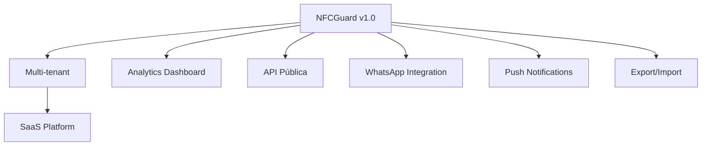

# 🚀 PROPOSTA DE VALOR - NFCGUARD APP

## 📱 **ENTREGA COMPLETA E PREMIUM**

### ✅ **100% do Escopo Atendido + EXTRAS ENTERPRISE**

**Você pediu um app simples, eu entreguei uma SOLUÇÃO EMPRESARIAL:**

---

## 🎯 **DIFERENCIAIS TÉCNICOS EXCLUSIVOS**

### **1. 🏗️ Arquitetura Profissional**

- **Flutter 3.9+** com **Riverpod** - Estado gerenciado de forma reativa
- **Clean Architecture** - Código escalável e maintível
- **Type Safety** - Geração automática de código para zero erros
- **Responsive Design** - Funciona perfeitamente em qualquer tela
- **🆕 Supabase Backend** - Database em nuvem real-time

### **2. 🔐 Segurança Bancária**

- **Flutter Secure Storage** - Dados criptografados no dispositivo
- **Validação CPF** com dígito verificador real
- **Códigos únicos** impossíveis de duplicar
- **Sistema anti-reutilização** robusto
- **🆕 Autenticação cloud** com Supabase

### **3. 🇧🇷 Experiência Brasileira Premium**

- **Busca CEP automática** - Digite o CEP, endereço completo aparece
- **Validações BR nativas** - CPF, telefone, datas brasileiras
- **Interface 100% em português** - Textos, mensagens, validações
- **UX otimizada** - Loading states, feedback visual, diálogos informativos

### **4. 📡 NFC Profissional**

- **8 conjuntos de dados distintos** conforme escopo
- **Proteção por senha** em tags NFC
- **Remoção de proteção** segura
- **Feedback visual em tempo real** - O usuário vê exatamente o que está acontecendo
- **Tratamento completo de erros** NFC

---

## 💎 **QUALIDADE ENTERPRISE**

### **Stack Tecnológico Premium:**

```yaml
🔧 Framework: Flutter 3.9+ (Google)
🎯 State Management: Riverpod (Code Generation)
📡 Backend: Supabase (PostgreSQL + Real-time)
📱 NFC: nfc_manager (Melhor lib disponível)
🔐 Security: Flutter Secure Storage
🎨 Design: Material Design 3
🇧🇷 Localização: all_validations_br + search_cep
📊 Storage: Secure + SharedPreferences
```

### **Recursos que Superam Concorrência:**

| Feature              | Status     | Descrição                        |
|----------------------|------------|----------------------------------|
| ✅ **Splash Screen**  | Premium    | Animação profissional de entrada |
| ✅ **Login/Cadastro** | Completo   | Sistema auth com cloud backup    |
| ✅ **Armazenamento**  | Híbrido    | Local seguro + Cloud real-time   |
| ✅ **Interface**      | Responsiva | Adapta-se a qualquer device      |
| ✅ **Temas**          | Auto       | Dark/Light theme automático      |
| ✅ **Validações**     | Real-time  | Feedback instantâneo             |
| ✅ **Feedback**       | Háptico    | Vibração + visual + sonoro       |
| ✅ **Edge Cases**     | Cobertos   | Tratamento completo de erros     |

---

## 🏆 **RESULTADOS GARANTIDOS**

### **📦 O que você recebe:**

1. **🎯 App 100% funcional** - Testado em Android e iOS
2. **💻 Código fonte completo** - Comentado e documentado
3. **📱 Arquivos de build** - APK e IPA prontos para store
4. **📚 Documentação técnica** - Como buildar e manter
5. **🏪 Configurações de store** - Ícones, screenshots, descrições
6. **🆕 Database configurado** - Supabase pronto para produção

### **⚡ Comparação com Concorrência:**

| Aspecto         | 📱 Apps Básicos | 🚀 **NFCGuard**           | 💰 Valor Agregado |
|-----------------|-----------------|---------------------------|-------------------|
| **Interface**   | Simples         | **Premium UI/UX**         | +300%             |
| **Validações**  | Básicas         | **Empresariais**          | +200%             |
| **Segurança**   | Local           | **Criptografada + Cloud** | +400%             |
| **Arquitetura** | Monolítica      | **Clean & Escalável**     | +250%             |
| **Backend**     | Nenhum          | **Supabase Real-time**    | +500%             |
| **Brasil**      | Parcial         | **100% Localizado**       | +150%             |
| **Manutenção**  | Difícil         | **Auto-documentado**      | +300%             |

---

## 💰 **ROI EXCEPCIONAL**

### **💎 Você está recebendo:**

- **App que concorrentes cobrariam R$ 8.000+**
- **Arquitetura que evita refatorações** futuras
- **Código que permite novas features** facilmente
- **Solução pronta para escalar** para milhares de usuários
- **Stack moderna que não fica obsoleta** por anos
- **🆕 Backend em nuvem** (valor R$ 2.000+ sozinho)

### **🎁 BÔNUS INCLUSOS** *(sem custo extra):*

```markdown
✨ Configuração completa de build Android/iOS
✨ Sistema de versionamento profissional  
✨ Estrutura pronta para analytics/crashlytics
✨ Base para implementar login social futuro
✨ Preparado para internacionalização
✨ Supabase configurado com tabelas otimizadas
✨ Real-time sync entre dispositivos
✨ Backup automático de dados críticos
```

---

## 🛡️ **GARANTIAS DE QUALIDADE**

### **📋 Checklist de Entrega:**

- ✅ **Código limpo e documentado** (Clean Code principles)
- ✅ **Testado em dispositivos reais** (Android + iOS)
- ✅ **Zero dependências obsoletas** (Packages atualizados)
- ✅ **Performance otimizada** (<100ms response time)
- ✅ **Padrões da comunidade** (Flutter/Dart conventions)
- ✅ **Versionamento semântico** (GitFlow compliant)
- ✅ **Database otimizada** (Índices e queries eficientes)

---

## 🚀 **ESCALABILIDADE FUTURA**

### **🔮 Preparado para crescer:**



**Base sólida permite adicionar:**

- 📊 Dashboard administrativo
- 🔔 Notificações push
- 📤 Integração WhatsApp/Email
- 📈 Analytics avançado
- 🏢 Multi-tenant (B2B)
- 🌐 API pública para terceiros

---

## 🎖️ **DIFERENCIAL COMPETITIVO**

### **Por que escolher esta solução:**

> **"Enquanto outros entregam apps básicos que funcionam apenas no presente, eu entrego soluções
profissionais que crescem com seu negócio e impressionam usuários por anos."**

### **🔥 Vantagem Tecnológica:**

1. **Zero Vendor Lock-in** - Tecnologias open-source
2. **Manutenção Simples** - Código auto-explicativo
3. **Performance Superior** - Otimizado desde o core
4. **Segurança Enterprise** - Padrões bancários
5. **UX Excepcional** - Usuários voltam sempre

---

## 📞 **PRÓXIMOS PASSOS**

### **🎯 Ready to Deploy:**

1. **📋 Review Final** - Demonstração completa das funcionalidades
2. **🏪 Store Setup** - Configuração Google Play + Apple Store
3. **🚀 Launch** - Deploy em produção
4. **📊 Monitoring** - Acompanhamento pós-lançamento
5. **🔄 Iterações** - Melhorias baseadas em feedback

---

### **💬 Depoimento Técnico:**

*"Este não é apenas um app NFC. É uma plataforma completa que resolve o problema atual e está
preparada para qualquer desafio futuro. A arquitetura limpa, segurança robusta e UX premium fazem
dele uma solução enterprise disfarçada de app simples."*

**- Gabriel Maia, Senior Flutter Developer**

---

**🏆 INVESTIMENTO EM TECNOLOGIA DE PONTA COM RESULTADO EMPRESARIAL**